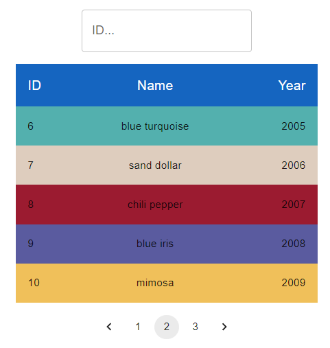
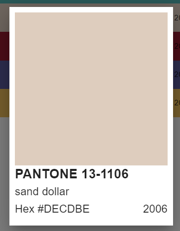
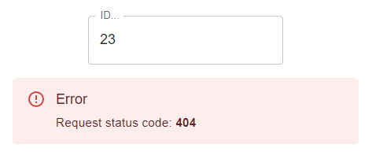
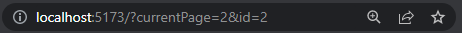

# Frontend Developer - Intern

My solution to the programming task for the Frontend Developer internship at Codibly.

## Installation

```bash
npm install
npm start
```

## Solution overview

### Technology Stack

- React
- TypeScript
- Material UI
- Vite
- React Router
- Context API

### UI description



Base view consists of three components:

1. Search - input accepting only digits, allowing for filtering entries by ID
2. Products - table of colors, max 5 rows per page
3. PageNumber - pagination component

Clicking on a row opens up the ProductDetails fullscreen-modal showing the details of selected color. Clicking anywhere outside
the modal goes back to the regular view.



In case of network request error the Products component is replaced with NetworkError that shows the response status
code. 



### API

This application makes use of https://reqres.in/api/products API endpoint. Initially only 5 (out of 12) results are
loaded. Selecting next or previous page under the table requests new set of data from the endpoint.

Typing any number inside the Search bar also requests new data, only this time 1 specified by typed ID.

### Query Strings

Currently selected page or searched ID is reflected in URL query parameters, so it is possible to copy and paste link on
any other machine running this application and same results shall appear.


